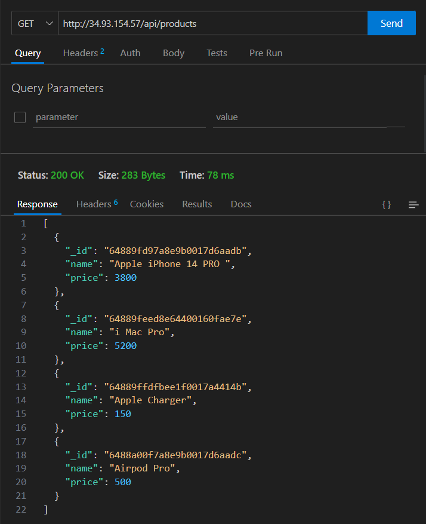
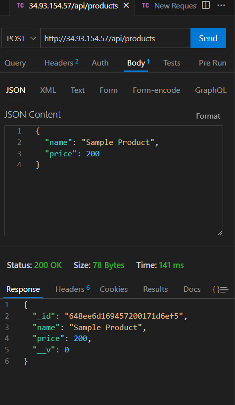

# NODE REST API

## This is a simple REST API app

## Source Code Repository - 

### Docker hub URL for images

Node REST API - https://hub.docker.com/r/iamnsharma/node-rest-api

Mongo DB - https://hub.docker.com/_/mongo

### Deployment steps

1. Deploy `namespace.yaml` to create custom K8s namespace
2. Deploy `mongodb-deployment.yaml` to deploy Database Service
3. Deploy `rest-api-deployment.yaml` to deploy application

#### How to test

Use any REST Client like Postman or ThunderClient in VSCode to submit HTTP requests.

Endpoint - http://{hostName}:{port}/api/products

deployed version - http://34.93.154.57/api/products 

## Sample GET Request - 

## Sample POST Request - 

